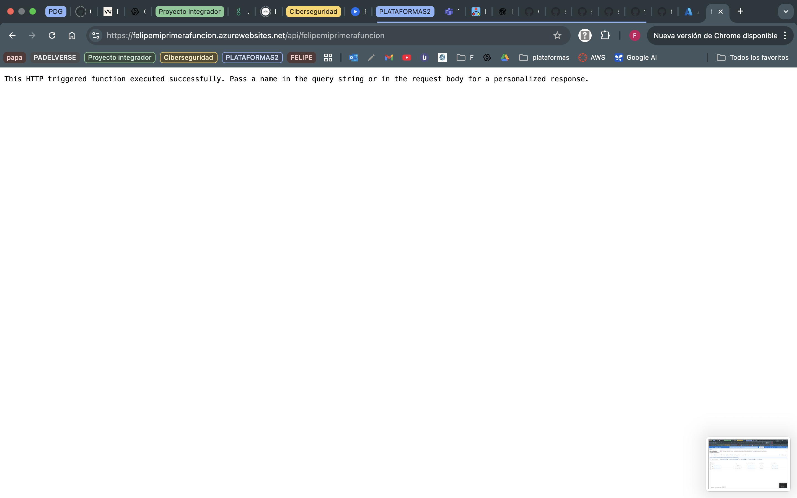
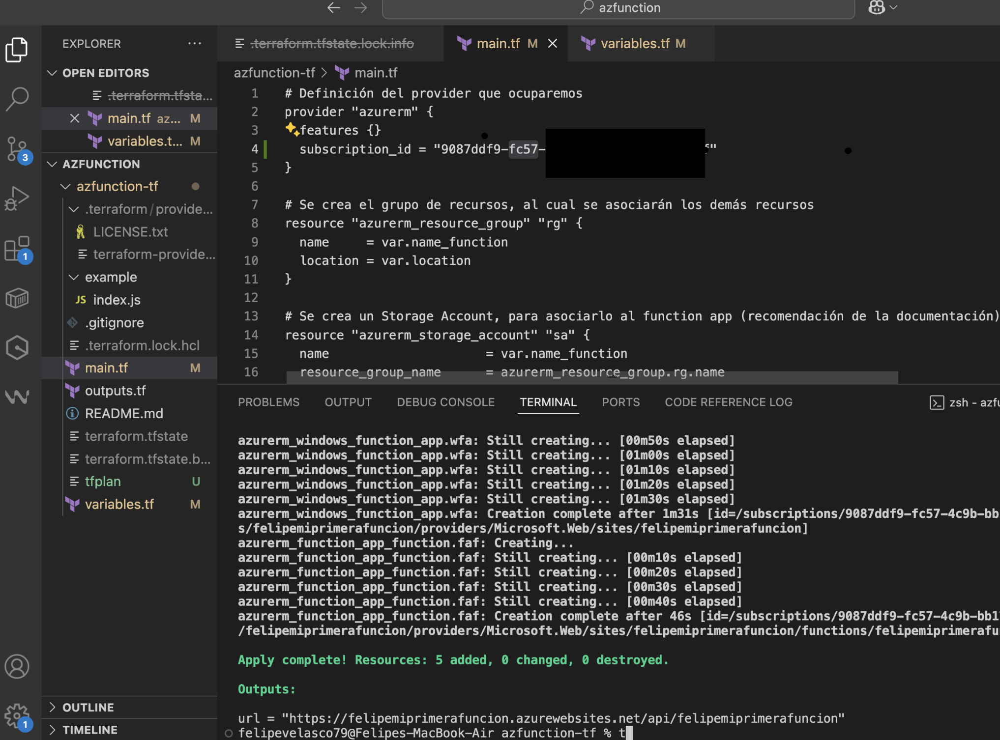
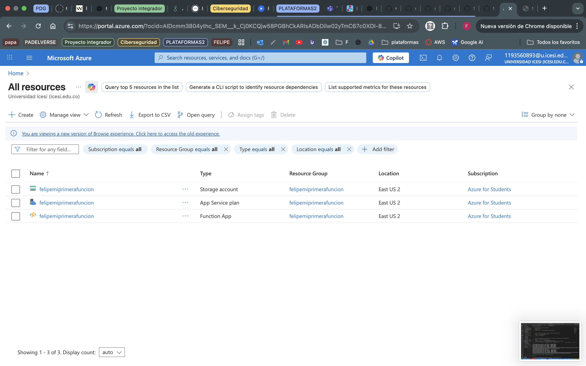

# **Infraestructura como código**
### **AZ FUNCTION FELIPE VELASCO A00380555 como código**
## Informe de Implementación con Terraform en Azure

En este proyecto se configuró e implementó una Function App en Azure utilizando **Terraform**.  
A continuación, se detallan los pasos principales realizados durante el proceso:

1. **Autenticación en Azure**
   ```bash
   az login
   ```

Se inició sesión en Azure CLI para que Terraform pudiera acceder a la suscripción y gestionar recursos.

2. Clonar el repositorio
```bash
git clone https://github.com/ChristianFlor/azfunction-tf.git
```

Se descargó el repositorio que contenía la definición de infraestructura como código (IaC).

3. Configurar la suscripción en el main.tf
En el archivo main.tf, se añadió el subscription_id correspondiente a la suscripción de Azure utilizada:
```bash
provider "azurerm" {
  features {}
  subscription_id = "<tu-subscription-id>"
}
```


4. Inicializar Terraform
```bash
terraform init
```
Se descargaron los proveedores necesarios (en este caso azurerm) y se preparó el entorno de Terraform.

Planificación de la infraestructura

5. terraform plan

Se revisó el plan de ejecución para verificar los recursos que serían creados en Azure (Resource Group, Storage Account, Service Plan y Function App).

Aplicar cambios en Azure
```bash
terraform apply
```

Finalmente, se ejecutó el despliegue de la infraestructura en la nube de Azure, creando los recursos definidos en los archivos de Terraform.

# Con estos pasos se logró desplegar una Function App en Azure de manera automatizada mediante Terraform, aplicando los principios de Infraestructura como Código (IaC) y asegurando la reproducibilidad de la infraestructura.

url = "https://felipemiprimerafuncion.azurewebsites.net/api/felipemiprimerafuncion"

## Capturas de Pantalla

### Aplicación funcionando en el contenedor



### Verificación con Terraform Plan


### Infraestructura desplegada en Azure

